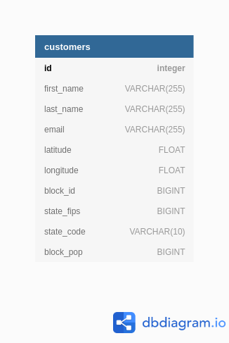
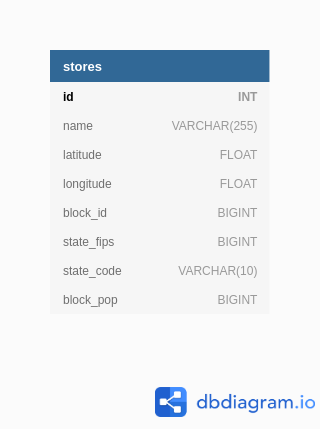

     


## API DB Ingestion

## Implementation
[Go](https://github.com/bclipp/api_db_ingestion/tree/master/go)  
[Python](https://github.com/bclipp/api_db_ingestion/tree/master/python/app)  
[Scala](https://github.com/bclipp/api_db_ingestion/tree/master/scala)  

## Objective:
Write an application that combines the data in the local company database with an external API.

## Requirements:

The app should be able to run on a system with limited resources.

## Data:

1. Local Database running PostgreSQL provided via a docker container.
Which will contain the following customer data tables:
  
   
  
   
  

2. The External API:

swagger doc:

https://geo.fcc.gov/api/census/#!/block/get_block_find

example api call:  

https://geo.fcc.gov/api/census/area?lat=37.299590&lon=-76.742290&format=json


Outcome:

Customers and stores are updated with the following information
blockID or block fips id, state_fips, state code ,and block population.


## Docker Setup

1. Install docker and docker-compose

2. 
```
xexport POSTGRES_DB=project01  
export POSTGRES_USER=project01  
export POSTGRES_PASSWORD=project01  
export DB_IP_ADDRESS=127.0.0.1  
# set if you want to run intergration tests
# export INTERGRATION_TEST=True

sudo --preserve-env docker-compose up
```

## Connecting to Database UI

*URL*: http://localhost:8080/  
*SYSTEM*: PostgreSQL  
*USER*: project01  
*PASSWORD*: project01  
*DB*: project01  


### Continuous Integration
[Github Actions CI YAML](https://github.com/bclipp/api_db_ingestion/blob/master/.github/workflows/python-app.yml)
